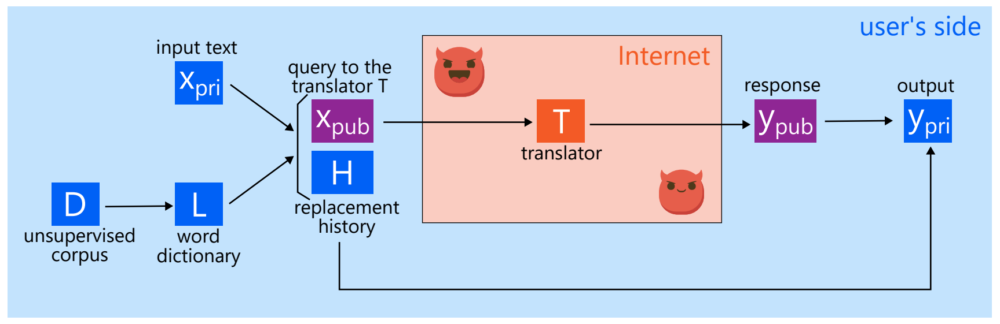

# Making Translators Privacy-aware on the User’s Side (TMLR 2024)

[](https://arxiv.org/abs/2312.04068)

<p align="center">
  
</p>

We propose PRISM to enable users of machine translation systems to preserve the privacy of data on their own initiative.

Paper: https://arxiv.org/abs/2312.04068

## ✨ Summary



▲ **Overview of PRISM**: PRISM converts the input sentence into a privacy-less sentence and sends it to the machine translation system. PRISM then converts the translated sentence back into the original sentence.

## 💿 Preparation

Install [Poetry ](https://python-poetry.org/) and run the following command:

```bash
$ poetry install
$ poetry run bash prepare.sh
```

Set an OpenAI API key in `.env`.

## 🧪 Evaluation

```bash
$ poetry run python eval.py --method prismstar --translator chatgpt
$ poetry run python eval.py --method prismr --translator chatgpt
$ poetry run python eval.py --method nodecode --translator chatgpt
$ poetry run python eval.py --method pup --translator chatgpt
```
Please refer to the help command for further options.

```
$ poetry run python eval.py -h
usage: eval.py [-h] [--lang LANG] [--basedir BASEDIR] [--rates RATES] [--method {pup,prismr,prismstar,nodecode}] [--translator {chatgpt,t5,t5-gpu}]

optional arguments:
  -h, --help            show this help message and exit
  --lang LANG
  --basedir BASEDIR
  --rates RATES
  --method {pup,prismr,prismstar,nodecode}
  --translator {chatgpt,t5,t5-gpu}
```

### Results


▲ **Results.** PRISM* strikes an excellent balance between privacy and translation quality.

Please refer to the paper for more details.

## ⛏️ How to Build a Dictionary by Yourself

Run the following command to extract candidate words from the corpus. It uses `load_mctest()` for the corpus. You can replace it with your own corpus. In general, it is recommended to use the same or similar corpus as the one used in the evaluation.

```bash
$ poetry run python extract_all_words.py
```

Then, run the following command to build a dictionary. It build a dictiory based on wmt14 dataset (i.e., a public news corpus).

```bash
$ poetry run python build_dict.py 1 -1 --target French
$ poetry run merge_cand_words.py cand_words_French_1000
```

Bulding the entire dictionary may take a long time. You can build each part separately (in separate machines) and merge them.

```bash
$ poetry run python build_dict.py 1 100 --target French
$ poetry run python build_dict.py 100 200 --target French
$ poetry run python build_dict.py 200 300 --target French
...
$ poetry run merge_cand_words.py cand_words_French_1000
```

## 🖋️ Citation

```
@article{sato2024making,
  author    = {Ryoma Sato},
  title     = {Making Translators Privacy-aware on the User’s Side},
  journal   = {Transactions on Machine Learning Research},
  year      = {2024},
}
```
